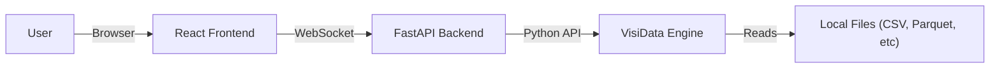

<div align="center">
  
  
  # VisiLens

  **Excel for Developers**
  
  A fast, local-first web GUI for exploring data with [VisiData](https://www.visidata.org/).

  [](https://opensource.org/licenses/MIT)
  [](https://www.python.org/downloads/)
  [](https://www.visidata.org/)
  [](https://fastapi.tiangolo.com/)
  [](https://reactjs.org/)
  [](http://makeapullrequest.com)

  [Features](#features) • [Installation](#installation) • [Usage](#usage) • [Architecture](#architecture) • [Contributing](#contributing)
</div>

---

## 🚀 Why VisiLens?

Data exploration shouldn't require writing boilerplate Pandas code or waiting for heavy spreadsheet software to load. **VisiLens** combines the raw speed and power of **VisiData** with a modern, intuitive web interface.

- **⚡️ Blazing Fast:** Powered by VisiData's highly optimized engine. Handle millions of rows with ease.
- **🔒 Local-First:** Your data never leaves your machine. No cloud uploads, no privacy concerns.
- **🛠 Developer Friendly:** CLI-first workflow. Pipe data in, explore, and get back to coding.
- **🔌 Universal Support:** Open CSV, TSV, JSON, Parquet, Excel, SQLite, and [50+ other formats](https://www.visidata.org/formats/).

## ✨ Features

- **Instant Visualization:** Just run `vdweb data.csv` and start exploring.
- **Real-time Sorting & Filtering:** Filter millions of rows instantly via WebSockets.
- **Modern Data Grid:** A clean, responsive React-based table view.
- **Format Agnostic:** If VisiData can read it, VisiLens can show it.
- **Zero Config:** No database setup or complex configuration required.

## 📦 Installation

VisiLens is available as a Python package.

```bash
pip install vdweb
```

*Note: VisiLens requires Python 3.10 or higher.*

## 💻 Usage

### Command Line Interface

The primary way to use VisiLens is via the command line.

```bash
# Open a CSV file
vdweb data.csv

# Open a Parquet file
vdweb large-dataset.parquet

# Open an Excel file
vdweb spreadsheet.xlsx

# Launch without opening the browser automatically
vdweb data.json --no-browser

# Specify a custom port
vdweb data.csv --port 9000
```

### Web Interface

Once launched, VisiLens opens in your default browser (usually `http://localhost:8000`).

1.  **View Data:** Scroll through your dataset efficiently.
2.  **Sort:** Click column headers to sort ascending/descending.
3.  **Filter:** Use the filter inputs to search within columns.
4.  **Load New Data:** (Coming Soon) Drag and drop files directly into the window.

## 🏗 Architecture

VisiLens is built on a robust modern stack designed for performance:

*   **Backend:** [FastAPI](https://fastapi.tiangolo.com/) + [Uvicorn](https://www.uvicorn.org/)
    *   Acts as a bridge to the VisiData core.
    *   Manages WebSocket connections for real-time state updates.
*   **Engine:** [VisiData](https://www.visidata.org/)
    *   Handles all data loading, parsing, sorting, and filtering.
    *   Provides the "metal" for high-performance data manipulation.
*   **Frontend:** [React](https://react.dev/) + [Vite](https://vitejs.dev/) + [Tailwind CSS](https://tailwindcss.com/)
    *   A lightweight Single Page Application (SPA).
    *   Uses a virtualized data grid to render only what you see.



## 🛠 Development

Want to contribute? Great! Here's how to set up the development environment.

### Prerequisites

- Python 3.10+
- Node.js 18+
- npm or pnpm

### Setup

1.  **Clone the repository**
    ```bash
    git clone https://github.com/sampan/VisiLens.git
    cd VisiLens
    ```

2.  **Backend Setup**
    ```bash
    # Create virtual environment
    python -m venv .venv
    source .venv/bin/activate  # or .venv\Scripts\activate on Windows

    # Install dependencies
    pip install -e ".[dev]"
    ```

3.  **Frontend Setup**
    ```bash
    cd frontend
    npm install
    ```

4.  **Run Locally**
    
    Terminal 1 (Backend):
    ```bash
    uvicorn backend.main:app --reload --port 8000
    ```

    Terminal 2 (Frontend):
    ```bash
    cd frontend
    npm run dev
    ```

## 📄 License

This project is licensed under the MIT License - see the [LICENSE](LICENSE) file for details.

---

<div align="center">
  Made with ❤️ by <a href="https://github.com/sampan">Sampan</a> and the Open Source Community.
</div>
